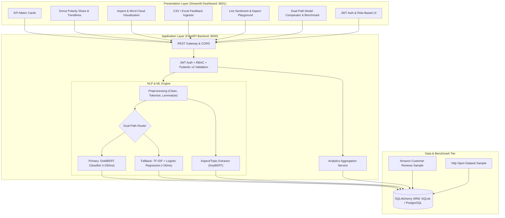

# Customer Sentiment Analysis Dashboard (PRJ_382)
> **Course / Project ID:** CSE7102 • PRJ_382 Review-1 Technical Implementation  
> **Institution:** Presidency University  
> **Architecture:** 3-Tier Production Architecture (FastAPI + Streamlit + SQLAlchemy Dual-Model NLP)

---

## 🚀 Key Highlights & Architecture



### 1. Dual-Path Machine Learning Engine
* **Primary Path**: DistilBERT 3-class sentiment transformer for deep contextual nuance with sub-250ms latency.
* **Fast-Path Fallback**: TF-IDF N-gram vectorizer + Logistic Regression classifier with ultra-fast sub-30ms execution time (10x-15x acceleration).
* **Smart Auto-Failover**: Automatically routes requests to the fast-path if transformer latency exceeds threshold SLA or compute constraints occur.

### 2. Aspect-Based Sentiment Extraction
* Candidate phrase extraction and syntactic noun chunk mining.
* Granular aspect-level sentiment polarity assignment (e.g. *battery life: negative*, *sound quality: positive*).

### 3. Role-Based Access Control (RBAC) & Security
* JWT Bearer authentication with HMAC-SHA256 tokens and bcrypt password hashing.
* Roles: `ADMIN` (Full Control), `ANALYST` (Ingestion & Evaluation), `VIEWER` (Read-only Analytics).

### 4. Interactive Streamlit Dashboard
* **Executive KPI Cards**: Real-time totals, positive/negative/neutral share, average inference latency, and Macro F1 status.
* **Interactive Charts**: Donut polarity distribution, multi-line temporal sentiment trends, and aspect-sentiment matrices.
* **Word Cloud**: Visual sentiment keyword distributions with colormap filters.
* **Live Playground**: Real-time text tester with instant token-level confidence bars and aspect chips.
* **Batch Ingestion Hub**: Drag-and-drop CSV/Excel file upload with column mapping and progress tracker.
* **Benchmark Center**: Live comparative evaluation on Amazon & Yelp review datasets with 3x3 confusion matrices and latency profilers.

---

## 🛠️ Quick Start & Running Locally

### Prerequisites
* Python 3.10+ installed

### 1. Install Dependencies
```bash
pip install -r requirements.txt
```

### 2. Launch System (Backend + Frontend)
Run the one-click launcher:
```bash
python scripts/run_all.py
```

Or run services independently:

**Start FastAPI Backend:**
```bash
python -m uvicorn backend.app.main:app --host 127.0.0.1 --port 8000 --reload
```
* Interactive API Documentation: [http://127.0.0.1:8000/docs](http://127.0.0.1:8000/docs)

**Start Streamlit Dashboard:**
```bash
python -m streamlit run frontend/app.py --server.port 8501
```
* Dashboard UI: [http://localhost:8501](http://localhost:8501)

---

## 👤 Default User Accounts

| Role | Email | Password | Access Level |
|---|---|---|---|
| **Admin** | `admin@sentiment.io` | `admin123` | Full access (CRUD, Benchmark, Ingest, Manage) |
| **Analyst** | `analyst@sentiment.io` | `analyst123` | Analytics, CSV Ingestion, Benchmarks |
| **Viewer** | `viewer@sentiment.io` | `viewer123` | Read-only Dashboard & Reports |

---

## 🧪 Running Automated Tests

Run the complete test suite verifying NLP pipelines, REST endpoints, and benchmark thresholds:
```bash
python -m pytest tests/ -v
```

---

## 📂 Project Directory Structure

```
miniproj/
├── backend/
│   ├── app/
│   │   ├── api/
│   │   │   ├── deps.py                  # JWT Auth & DB dependencies
│   │   │   └── endpoints/
│   │   │       ├── auth.py              # /api/v1/auth (login, register, me)
│   │   │       ├── predict.py           # /api/v1/predict, /api/v1/predict/batch
│   │   │       ├── feedback.py          # /api/v1/feedback, /api/v1/feedback/upload
│   │   │       ├── analytics.py         # /api/v1/analytics (KPIs, trends, aspects)
│   │   │       └── benchmark.py         # /api/v1/benchmark (model latency & F1 tests)
│   │   ├── core/
│   │   │   ├── config.py                # Pydantic Settings (.env, JWT secrets)
│   │   │   └── security.py              # Password hashing & JWT token generators
│   │   ├── db/
│   │   │   ├── base.py
│   │   │   ├── session.py               # Engine & sessionmaker (SQLite/Postgres)
│   │   │   └── init_db.py               # Database seeder (admin user & benchmark datasets)
│   │   ├── models/
│   │   │   ├── user.py                  # User & Role models
│   │   │   ├── feedback.py              # FeedbackRecord & AspectTag models
│   │   │   └── benchmark.py             # BenchmarkRun metrics model
│   │   ├── schemas/
│   │   │   ├── user.py                  # UserCreate, UserLogin, Token schemas
│   │   │   ├── feedback.py              # FeedbackInput, FeedbackResponse, BatchUpload schemas
│   │   │   └── analytics.py             # KPISummary, SentimentDistribution schemas
│   │   ├── services/
│   │   │   ├── nlp_pipeline.py          # DualPathClassifier orchestrator & fallback logic
│   │   │   ├── preprocessor.py          # Text cleaner, contractions, lemmatizer
│   │   │   ├── transformer_model.py     # DistilBERT classifier implementation
│   │   │   ├── fast_model.py            # TF-IDF + Logistic Regression classifier implementation
│   │   │   ├── aspect_extractor.py      # Aspect & keyword extractor
│   │   │   └── evaluator.py             # Macro F1, precision, recall & latency profiler
│   │   └── main.py                      # FastAPI application entrypoint with CORS
├── frontend/
│   ├── app.py                           # Streamlit multi-page dashboard application
│   ├── components/
│   │   ├── auth_view.py                 # Login / Register / Role selector UI
│   │   ├── kpi_cards.py                 # Metric cards (Volume, Sentiment %, Latency, F1)
│   │   ├── charts.py                    # Donut chart, trendlines, aspect frequency bars
│   │   ├── wordcloud_view.py            # Word cloud & topic frequency generator
│   │   ├── batch_upload.py              # CSV/Excel drag-and-drop ingestion & progress bar
│   │   ├── live_tester.py               # Single feedback tester with instant aspect tags
│   │   └── model_benchmark_view.py      # Dual-path performance comparator & metrics view
│   ├── utils/
│   │   └── api_client.py                # HTTP client calling FastAPI endpoints
│   └── styles/
│       └── custom.css                   # Modern dark glassmorphic styling
├── data/
│   ├── amazon_reviews_sample.csv        # Amazon Customer Reviews benchmark dataset
│   └── yelp_reviews_sample.csv          # Yelp Open Dataset benchmark sample
├── tests/
│   ├── test_nlp_pipeline.py             # Unit tests for preprocessing & dual-path models
│   ├── test_api_endpoints.py            # Integration tests for FastAPI endpoints
│   └── test_benchmarks.py               # Latency & Macro F1 automated assertions
├── scripts/
│   ├── train_fast_model.py              # Script to train & serialize TF-IDF + LR model
│   ├── seed_data.py                     # Script to seed database with benchmark reviews
│   └── run_all.py                       # One-click launcher for Backend & Frontend
├── .env.example
├── .gitignore
├── requirements.txt
└── README.md
```
